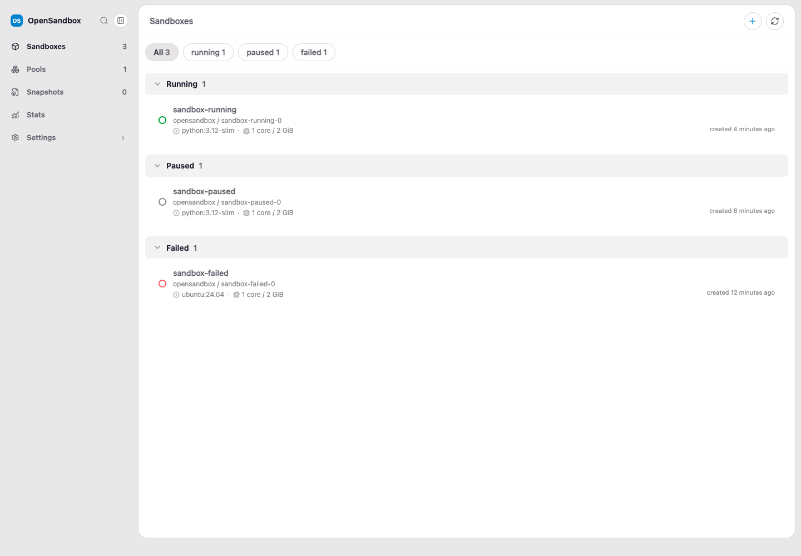
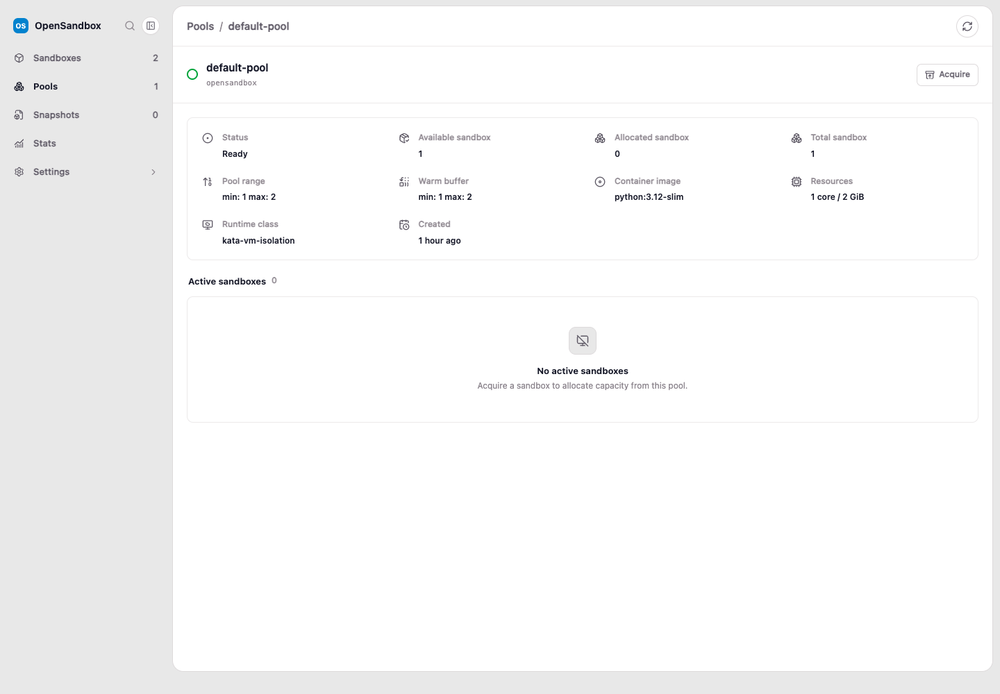
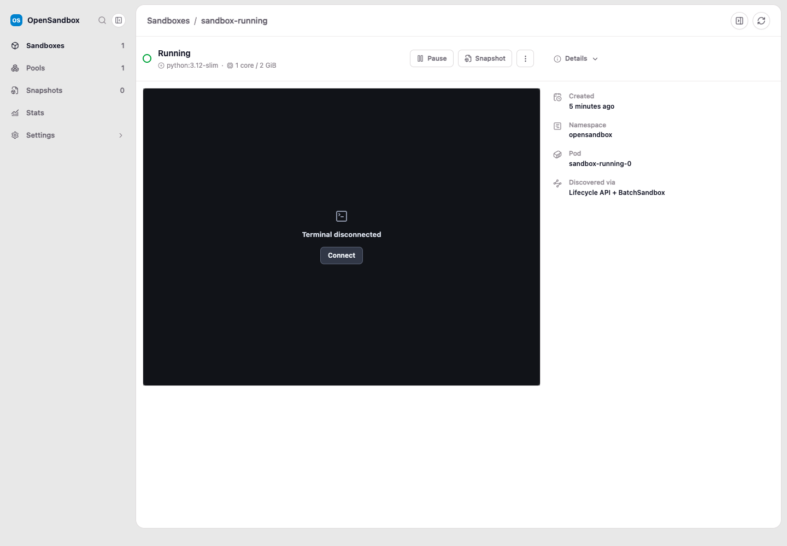
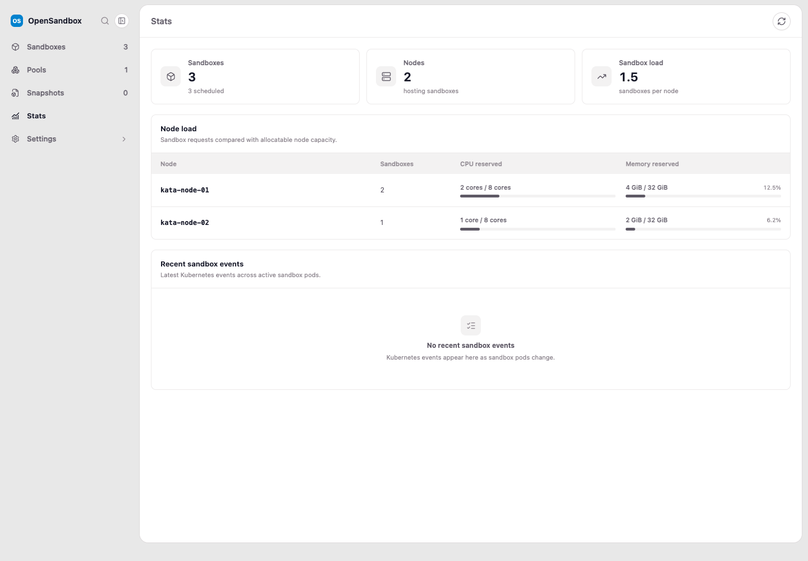

# OpenSandbox Dashboard

A lightweight Go and HTMX dashboard for discovering and operating sandboxes in
an OpenSandbox Kubernetes cluster.

## Dashboard workflow

The dashboard provides one place to create, inspect, operate, and monitor
OpenSandbox workloads:

<table>
  <thead>
    <tr>
      <th width="32%">Workflow</th>
      <th width="68%">Dashboard</th>
    </tr>
  </thead>
  <tbody>
    <tr>
      <td valign="top">
        <strong>1. Find or create a sandbox</strong>
        <p>The Sandboxes view groups workloads by lifecycle state and shows each workload's image, pod, resources, and age. Use the <strong>+</strong> action to create an on-demand sandbox, or open an existing sandbox to manage it.</p>
      </td>
      <td valign="top"></td>
    </tr>
    <tr>
      <td valign="top">
        <strong>2. Acquire pre-warmed capacity from a Pool</strong>
        <p>The Pools views show ready, allocated, and total capacity together with the image, runtime class, and scaling limits. Open a Pool and select <strong>Acquire</strong> to claim an available sandbox without waiting for a fresh workload to start.</p>
      </td>
      <td valign="top"></td>
    </tr>
    <tr>
      <td valign="top">
        <strong>3. Work in and manage the sandbox</strong>
        <p>The sandbox detail view includes an in-browser terminal plus lifecycle actions. Connect to the terminal, pause or resume the sandbox, create a snapshot, or use the actions menu for additional operations. The details pane identifies the backing namespace and pod.</p>
      </td>
      <td valign="top"></td>
    </tr>
    <tr>
      <td valign="top">
        <strong>4. Preserve work and watch capacity</strong>
        <p>Create named snapshots from running sandboxes, then restore or delete them from <strong>Snapshots</strong>. Use <strong>Stats</strong> to review scheduled sandbox count, node load, reserved CPU and memory, and recent Kubernetes events.</p>
      </td>
      <td valign="top"></td>
    </tr>
  </tbody>
</table>

The screenshots use deterministic mock data; the same UI is populated from the
connected OpenSandbox Kubernetes cluster at runtime.

## Run locally

```bash
just dev /path/to/kubeconfig
```

The dashboard listens on `127.0.0.1:8080` by default. Override the address with
`HTTP_ADDR`.

### Component workbench

The development-only [Swapbook](https://github.com/aejkatappaja/swapbook)
workbench renders dashboard pages and states with the production templates,
styles, scripts, and HTMX behavior—without requiring a Kubernetes cluster or a
JavaScript toolchain:

```bash
just swapbook
```

Open `http://127.0.0.1:7007/__sb/`. The command builds a target with the
`swapbook` Go build tag on `127.0.0.1:8081`, then starts the pinned Swapbook
proxy. Override those ports with `SWAPBOOK_TARGET_ADDR` and `SWAPBOOK_PORT`.
The adapter and fixture stories are excluded from normal dashboard builds. See
[the Swapbook development workflow](docs/swapbook.md) for story authoring,
controls, inspection scenarios, generated artifacts, and guidance on choosing
Swapbook versus live-cluster E2E tests.

To check only that every story renders:

```bash
# terminal 1
go run -tags swapbook ./cmd/osb-dashboard-swapbook

# terminal 2
go run github.com/Aejkatappaja/swapbook/cmd/swapbook@v0.5.0 \
  check --target http://127.0.0.1:8081
```

Generate the code-defined visual and semantic inspection matrix with:

```bash
just swapbook-inspect
```

Artifacts are written under `.playwright/swapbook-inspection/<run-id>/`. Open
`report.html` to review each screenshot beside its assertions, semantic
snapshot, rendered HTML, and relevant source files. `report.json` and
`llm-review.md` provide the same evidence in a form suitable for automated or
LLM-assisted review. The command exits non-zero on assertion or browser-console
failures.

### Subpath hosting

Use `--base-path` (or `OSB_DASHBOARD_BASE_PATH`) when the dashboard is exposed
beneath a URL prefix:

```bash
go run ./cmd/osb-dashboard \
  --kubeconfig /path/to/kubeconfig \
  --base-path /dashboard
```

The application will then serve its UI, assets, HTMX endpoints, browser-history
URLs, forms, and terminal WebSocket beneath `/dashboard`. Configure the reverse
proxy to forward that prefix unchanged; requests to `/dashboard` redirect to
`/dashboard/`.

## Container image

Pushes to `main`, version tags such as `v1.2.3`, and manual workflow runs publish
a multi-platform image to:

```text
ghcr.io/bahe-msft/osb-dashboard
```

The container runs as a non-root user. Mount a kubeconfig and provide an auth
token when exposing the dashboard outside the container:

```bash
docker run --rm -p 8080:8080 \
  -e HTTP_ADDR=0.0.0.0:8080 \
  -e OSB_DASHBOARD_AUTH_TOKEN='replace-with-a-strong-token' \
  -e OSB_DASHBOARD_BASE_PATH='/dashboard' \
  -v "$HOME/.kube/config:/config/kubeconfig:ro" \
  ghcr.io/bahe-msft/osb-dashboard:latest \
  --kubeconfig /config/kubeconfig
```

With the example above, open `http://localhost:8080/dashboard/`.

Published images support `linux/amd64` and `linux/arm64`. The workflow also
publishes branch, semantic-version, and commit-SHA tags and attaches provenance
and an SBOM. After the first publish, set the package visibility to **Public** in
GitHub Packages if anonymous pulls are required.

## Authentication

Loopback development can run without authentication. A non-loopback
`HTTP_ADDR` requires a dashboard token:

```bash
HTTP_ADDR=0.0.0.0:8080 \
OSB_DASHBOARD_AUTH_TOKEN='replace-with-a-strong-token' \
go run ./cmd/osb-dashboard --kubeconfig /path/to/kubeconfig
```

Clients may authenticate with either:

- HTTP Basic authentication, using the token as the password; or
- `Authorization: Bearer <token>`.

Non-browser clients that call mutation endpoints must also send
`X-OSB-CSRF: 1`. Browser mutations and terminal WebSockets are restricted to the
same origin.

For production, terminate TLS at a trusted reverse proxy and keep the dashboard
on a private network.

## Use as a Go library

The module root is importable as `github.com/bahe-msft/osb-dashboard`. The
OpenSandbox client package is also public so applications can configure the
client and mount the dashboard alongside their own routes:

```go
client, err := opensandbox.NewFromKubeconfig(kubeconfigPath, opensandbox.Options{
    Namespace:         "opensandbox-system",
    WorkloadNamespace: "opensandbox",
})
if err != nil {
    return err
}
defer client.Close()

app, err := dashboard.New(client, dashboard.Options{
    SandboxImage: "python:3.12-slim",
    BasePath:     "/dashboard",
    RegisterRoutes: func(mux *http.ServeMux) {
        // Available at /dashboard/api/example and protected by the same
        // authentication, CSRF, and security middleware as the dashboard.
        mux.HandleFunc("GET /api/example", exampleHandler)
    },
})
if err != nil {
    return err
}
defer app.Close()

return http.ListenAndServe(":8080", app.Handler())
```

Use these imports with the example:

```go
import (
    "net/http"

    dashboard "github.com/bahe-msft/osb-dashboard"
    "github.com/bahe-msft/osb-dashboard/opensandbox"
)
```

The UI templates and all web assets are embedded in the library with
`go:embed`, including the Ghostty terminal JavaScript and WebAssembly runtime.
Callers do not need to copy or serve the `web` directory. The client remains
caller-owned and must be closed separately.

### Direct in-cluster lifecycle access

By default, lifecycle operations use the Kubernetes Service proxy. An in-cluster
host can bypass that proxy while retaining Kubernetes discovery and API-key
loading:

```go
client, err := opensandbox.NewInCluster(opensandbox.Options{
    Namespace:         "opensandbox-system",
    WorkloadNamespace: "opensandbox",
    LifecycleEndpoint: "http://opensandbox-server.opensandbox-system.svc.cluster.local",
})
```

A direct endpoint uses a separate plain HTTP client by default, preventing the
Kubernetes service-account bearer token from being forwarded to OpenSandbox.
Use `LifecycleHTTPClient` only when the endpoint requires a custom transport.

## Tests

```bash
just test
just e2e /path/to/isolated-cluster.kubeconfig
```

The live E2E suite creates and deletes a sandbox. See [e2e/README.md](e2e/README.md)
for categories, configuration, traces, and video recordings.
